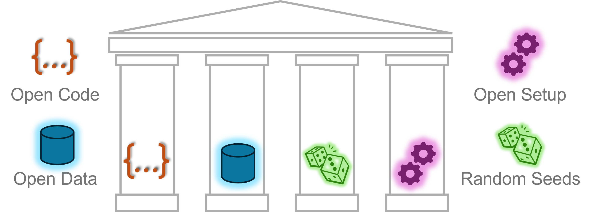

# Reproducible Deep Learning Research with GPU-Jupyter: A Demo Project  

**This repository demonstrates how to use [GPU-Jupyter](https://github.com/iot-salzburg/gpu-jupyter) to ensure reproducible deep learning research with minimal setup effort.**  

Reproducibility is a fundamental requirement of the scientific method. However, many meta-studies highlight a reproducibility crisis across scientific disciplines.
[**GPU-Jupyter**](https://github.com/iot-salzburg/gpu-jupyter) is a flexible and efficient **framework for reproducible deep learning experiments** by encapsulating the entire experimental setup into an isolated, GPU-supported containerized environment. This approach mitigates version conflicts, ensures a well-defined setup, and streamlines the sharing and collaboration of research.  

  

Reproducibility in deep learning is facilitated by four key pillars:  

1. **Open Code**: Code and workflows should be shared in a version-controlled manner.  
2. **Open Data**: Publicly available datasets ensure accessibility and verification.  
3. **Controlled Randomness**: Using fixed random seeds ensures deterministic results.  
4. **Reproducible Setup**: Computational environments should be well-defined and portable.  

**GPU-Jupyter specifically addresses the fourth pillar** by a **containerized deep learning setup** that ensures experiments can be executed and verified seamlessly across different systems.  
This repository demonstrates how to use [GPU-Jupyter](https://github.com/iot-salzburg/gpu-jupyter) to:  

- **reproduce existing research**.  
- **make your own deep learning experiments reproducible in a single command**.  


## Table of Contents

1. [Requirements](#requirements)
2. [Reproduce a Deep Learning Experiment](#reproduce-a-deep-learning-experiment)
   - [Variant 1: Reproducing Existing Work, Published with or without GPU-Jupyter](#variant-1-reproducing-existing-work-published-with-or-without-gpu-jupyter)
   - [Variant 2: Reproducing Existing Work with a Customized GPU-Jupyter Setup](#variant-2-reproducing-existing-work-with-a-customized-gpu-jupyter-setup)
3. [Make Your Own Research Reproducible](#make-your-own-research-reproducible)
   - [Variant 1: Publishing Work in a Standard GPU-Jupyter Environment](#variant-1-publishing-work-in-a-standard-gpu-jupyter-environment)
   - [Variant 2: Publishing in a Customized GPU-Jupyter Image](#variant-2-publishing-in-a-customized-gpu-jupyter-image)
4. [More Information](#more-information)
5. [Cite This Work](#cite-this-work)


---
<br>

## Requirements  

To use GPU-Jupyter, the following components must be installed on the host system:

- **NVIDIA GPU**: A compatible NVIDIA GPU is required to accelerate deep learning computations.  
- **NVIDIA CUDA Drivers**: The CUDA toolkit provides the necessary drivers and runtime libraries that enable GPU acceleration for deep learning frameworks like PyTorch and TensorFlow. GPU-Jupyter is built on NVIDIA’s official CUDA Docker images to ensure compatibility. Install the latest version from [NVIDIA CUDA Toolkit](https://developer.nvidia.com/cuda-toolkit).  
- **Docker Engine**: [Docker](https://www.docker.com/get-started) ensures a reproducible execution environment by isolating deep learning experiments from the host system, preventing dependency conflicts and facilitating portability.  
- **NVIDIA Container Toolkit**: This toolkit allows Docker containers to access GPU resources on the host system, ensuring full hardware acceleration inside the containerized deep learning environment. Official installation instructions are available on [NVIDIA’s GitHub repository](https://github.com/NVIDIA/nvidia-container-toolkit).  

For the setup on the host server, please follow the installation steps in this article [Medium.com/Set up Your own GPU-based Jupyter easily using Docker](https://cschranz.medium.com/set-up-your-own-gpu-based-jupyterlab-e0d45fcacf43). 

---
<br>


## Reproduce a Deep Learning Experiment

### Variant 1: Reproducing Existing Work, Published with or without GPU-Jupyter

To reproduce a deep learning experiment, follow these steps:  

**1. Start a GPU-Jupyter container**  

Run the following command, replacing `$(pwd)` with the absolute path to your project directory:  

```bash
cd path/to/project
docker run --gpus all -it -p 8888:8888 \
    -v $(pwd):/home/jovyan/work \
    -e GRANT_SUDO=yes -e JUPYTER_ENABLE_LAB=yes \
    -e NB_UID=$(id -u) -e NB_GID=$(id -g) \
    --user root cschranz/gpu-jupyter:v1.9_cuda-12.6_ubuntu-24.04
```

Note the following Docker parameters:

- **`--gpus all`**: Grants the container access to all available GPUs on the host system, enabling GPU acceleration for deep learning workloads.  
- **`-it`**: Runs the container in **interactive mode**, allowing direct user interaction via a terminal (useful for executing commands inside the container).  
- **`-p 8888:8888`**: Maps **port 8888** of the container to **port 8888** on the host, enabling access to JupyterLab through `http://localhost:8888`.  
- **`-v $(pwd):/home/jovyan/work`**: Mounts the current directory (`$(pwd)`) on the host to `/home/jovyan/work` inside the container, ensuring persistent access to files and code across sessions.  
- **`-e GRANT_SUDO=yes`**: Grants the Jupyter user (`jovyan`) sudo privileges inside the container, allowing administrative commands if needed.  
- **`-e JUPYTER_ENABLE_LAB=yes`**: Ensures JupyterLab (instead of the classic Jupyter Notebook interface) is enabled when the container starts.  
- **`-e NB_UID=$(id -u) -e NB_GID=$(id -g)`**: Sets the **user ID (UID) and group ID (GID)** inside the container to match the host system’s user, preventing permission issues when accessing mounted files.  
- **`--user root`**: This is the default configuration for running Jupyter within containers, allowing unrestricted access to system configurations and software installations in the isolated environment.  


**2. Open JupyterLab**

Access JupyterLab at [http://localhost:8888](http://localhost:8888) (or the ip/hostname of the server instead of localhost with the specified port) and enter the access token printed in the Docker output:

```bash
[C 2025-02-17 12:25:57.988 ServerApp]

    To access the server, open this file in a browser:
        file:///home/jovyan/.local/share/jupyter/runtime/jpserver-22-open.html
    Or copy and paste one of these URLs:
        http://127.0.0.1:8888/lab?token=ba872bc692eb7d749bbfaf7ef1a48ce5a8ff3658f2d49b14
```

Then navigate in JuperLab's file explorer into `work/reproducible-research-with-gpu-jupyter/` and check out the project directory.

When mounting a directory into a container, inconsistent user permissions can lead to files and directories being hidden in Jupyter's file explorer. To ensure proper ownership, open a terminal in JupyterLab and run:  

```bash
ll  # check user permissions
sudo chown -R jovyan.users work/
```

**3. Clone the Experiment Repository**

Inside JupyterLab, open a terminal and execute:

```bash
cd work
git clone https://github.com/iot-salzburg/reproducible-research-with-gpu-jupyter
cd reproducible-research-with-gpu-jupyter/
pip install -r requirements.txt
```

This **recreates the original deep learning environment**, ensuring that all dependencies match the original research setup.

Then, reproduce the experiment by running the provided Jupyter Notebook under `src/modelling/train_ResNet.ipynb`.
Randomness is controlled by providing random seeds for functions in numpy, PyTorch, and PyTorch-CUDA.


#### Alternative Setup Using Docker Compose for Configuration Management

Instead of specifying all parameters manually in a `docker run` command, **Docker Compose** allows for a structured, version-controlled setup by defining configurations in the local `docker-compose.yml` file. Using a `docker-compose.yml` is particularly useful for **version-controlled setup configuration** in Git, **reusable setup** across different systems, and **simplified container management** to organize multiple services. Please find an example for this repository in `docker-compose.yml`, which constraints hardware resources (as often used for shared physical setups).

**Basic `docker-compose` Commands:**  

1. **Start GPU-Jupyter** (in the background):  
   ```bash
   docker-compose up -d
   ```
   - Builds (if necessary) and starts the container based on `docker-compose.yml`.  
   - The `-d` flag runs it in **detached mode**, meaning the container continues running in the background.  

2. **Stop and remove the container**:  
   ```bash
   docker-compose down
   ```
3. **View logs in real time**:  
   ```bash
   docker-compose logs -f
   ```


<br>

### Variant 2: Reproducing Existing Work with a Customized GPU-Jupyter Setup  

For fully automated reproducibility, the entire experiment—including **code, dependencies, and configurations**—can be packaged into a pre-configured **Docker image**. This approach eliminates manual setup steps, ensuring a seamless reproduction process.  

If the authors have **built and published a customized GPU-Jupyter image** to a container registry (e.g., DockerHub), the entire deep learning experiment can be **reproduced with a single command**:  

```bash
docker run --gpus all --rm -it -p 8888:8888 cschranz/reproducible-research-with-gpu-jupyter:v1.0
```

**Key Considerations:**  

- **Use the exact image provided only by the experiment's authors (for security reasons)** to ensure a **fully consistent computational environment**.  
- The example image `cschranz/reproducible-research-with-gpu-jupyter:v1.0` demonstrates a reproducible setup for this repository, but this should be replaced with the actual image reference from the research publication.  
- **No additional dependencies need to be installed**—the environment is already pre-configured within the container.  

This approach ensures that **any researcher can replicate the original computational setup** with minimal effort, making deep learning research more accessible, reliable, and reproducible.


<br>

## Make Your Own Research Reproducible  

GPU-Jupyter enables researchers to publish experiments with **full computational reproducibility**.  

### Variant 1: Publishing Work in a Standard GPU-Jupyter Environment

1. Develop deep learning models in **JupyterLab** inside a **GPU-Jupyter** container.  
2. Share the **code and dataset** in a public Git repository and/or data repository.  
3. Specify the **exact GPU-Jupyter image** used in the research paper.  
4. Explain all additional steps required for the setup and reproduction of the experiment.

**Example Open Science statement for your publication:**

> The authors ensure the reproducibility of their work 
> by providing all code, data, and environment details at `https://github.com/iot-salzburg/reproducible-research-with-gpu-jupyter`.
> All experiments were conducted with `<CPU/RAM>` and `<GPU model name/number>` using the image `cschranz/gpu-jupyter:v1.9_cuda-12.6_ubuntu-24.04` as available on DockerHub.

<br>


### Variant 2: Publishing in a Customized GPU-Jupyter image 

For the **reproducibility of your deep learning research in only one single command**, a **customized GPU-Jupyter image** can be built and published that includes the entire experiment.  

**Step 1: Define the Dockerfile**

Build a **Dockerfile** that installs all required dependencies. Use an appropriate tagged GPU-Jupyter image as base image and declare the full computational setup of your experiment from there, such as installations in package managers like `pip`. Use the local `Dockerfile` as an example. It is encouraged that datasets are externally referred (open data repos) or reasonably sized (compressed, no redundancy, etc.), as otherwise, the data size of the resulting image may be huge.

**Step 2: Log in to Docker Hub**

```sh
docker login
```
- Enter your **Docker Hub username** and **password** when prompted.
- If using **Access Tokens**, generate one from [Docker Hub](https://hub.docker.com/settings/security) and use it as the password.


**Step 3: Build the Docker Image**

```sh
docker build -t your-dockerhub-username/image-name:tag .
```

- `-t` specifies the **tag**. Specify your own username and repository name for `your-dockerhub-username/image-name:tag`.
- `.` assumes the **Dockerfile to build is in the current directory**.

Verify the image is built using:

```sh
docker images
```


**Step 4: Push the Image to DockerHub**

```sh
docker push your-dockerhub-username/image-name:tag
```

- The image will now be available on **Docker Hub** at:
  ```
  https://hub.docker.com/r/your-dockerhub-username/image-name
  ```


**Step 5: Verify if it worked: Pull and Run the Image**

Optimally, test on another machine by pulling and running your image using:

```sh
docker run --gpus all --rm -it -p 8888:8888 your-dockerhub-username/image-name:tag
```

To reproduce the experiment within the repository, run:

```sh
docker run --gpus all --rm -it -p 8888:8888 cschranz/reproducible-research-with-gpu-jupyter:v1.0
```
Please make sure to describe which scripts or Notebooks have to be executed to reproduce your research. 
In the case of this example repository, reproduce the experiment by running the provided Jupyter Notebook under `src/modelling/train_ResNet.ipynb` and check if the identical results are yielded


Include the **single-command execution** for reproducing your deep learning experiment in the research paper to **ensure future researchers can reproduce your work effortlessly** without additional setup steps.


Ensure that the data within the repository is reasonably sized or downloaded during the execution of the experiment. Otherwise, a big dataset is included in the image stored on DockerHub thus being redundant.


<br>

## More information

### Learn More About JupyterLab  

Here is a tutorial on how to use JupyterLab:

[](https://www.youtube.com/watch?v=A5YyoCKxEOU)

    Video: Introductory tutorial on the use of JupyterLab.  Created by Van Yang. Source: official channel of Jupyter on YouTube


### Customizing the Docker Container for Your Project  

GPU-Jupyter allows flexible configuration for **various deep learning workflows**:  

- Run **detached containers** using `-d` to keep them running in the background. Find more Docker commands in [Docker-Docs](https://docs.docker.com/).
- Set a **static access token** for persistent authentication, as described among other configurations in [github.com/GPU-Jupyter](https://github.com/iot-salzburg/gpu-jupyter).  
- Enable **sudo privileges** within the container using `-e GRANT_SUDO=yes`.  
- Adapt file ownership and permissions of mounted directories, e.g., ensure proper ownership:  

    ```bash
    sudo chown -R jovyan.users work/  # set ownership
    sudo chmod -R 660 work/           # set read and write permissions for the owning group
    sudo chmod -R g+X work/           # set the executable permission
    ```

<br>

## Cite This Work  

When you are using GPU-Jupyter for the development of your academic work and its reproduction, please cite the framework in your publication as:  

```
Schranz, C., Pilosov, M., Beeking, M. (2025).  
GPU-Jupyter: A Framework for Reproducible Deep Learning Research.  
[Manuscript submitted for publication] In Interdisciplinary Data Science Conference.  
```


By streamlining environment management, **GPU-Jupyter reduces barriers to reproducibility**, fostering an open and trustworthy research culture. 
